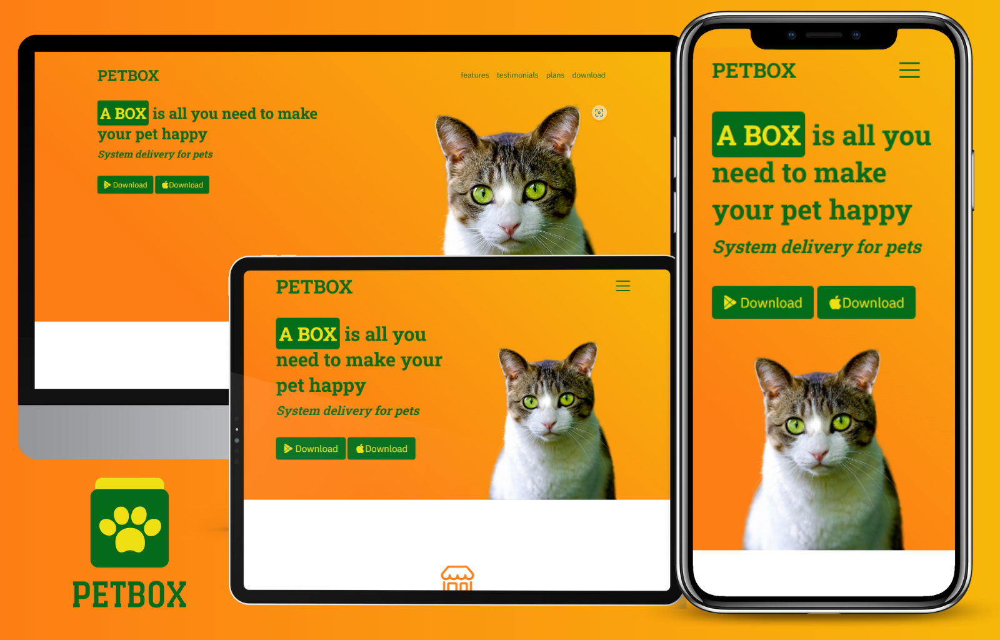
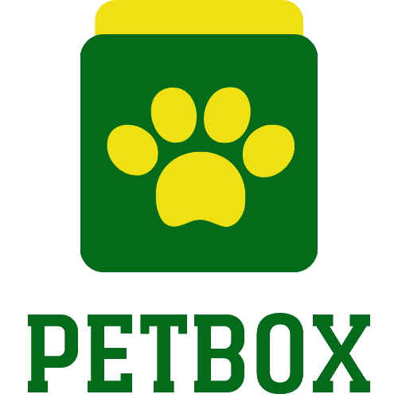

<h1>PetBox - delivery system for pets</h1>

  

<h2><a href="https://salahtiel.github.io/PetBox/">🔗 Accsses Project</a></h2>

---

## 🔎 INDEX

- [About](#📄-about)
- [Brand conveive](#💡-brand-conceive)
- [Technologies used](#🛠️-technologies-used)
- [Report](#📝-report)

## 📄 ABOUT

This project is a landing page developed by [ME](https://github.com/SalahTiel) with the intention of generating a new piece for my portfolio through the practical study of the Bootstrap library. PetBox is a **fictional company** conceived with the goal of creating a landing page from its brand identity.

## 💡 BRAND CONCEIVE

The creation of this fictitious brand started from the idea of a delivery system for domestic animals. PetBox has as values trust and friendship and this is what led to the choice of color palette.

  

## 🛠️ TECHNOLOGIES USED

- [HTML](https://developer.mozilla.org/en-US/docs/web/html)
- [CSS](https://developer.mozilla.org/en-US/docs/Web/CSS)
- [Bootstrap](https://getbootstrap.com/docs/5.3/getting-started/introduction/)

## 📝 REPORT

At the end of the development the project fulfilled its respective objectives:
Development of a piece for personal portfolio; 
Introduce the studies of the Bootstrap library; 
The biggest challenges were creating a fictitious brand for the development of this piece and using for the first time the elements and components of Bootstrap. Its development was fun as the project allowed me to use my creativity freely and did not require the use of any complex logic. I consider the difficulty of its development simple, but despite this it has brought me a lot of learning for the development of future pages like this.

---

<h2><a href="https://salahtiel.github.io/PetBox/">🔗 Accsses Project</a></h2>
